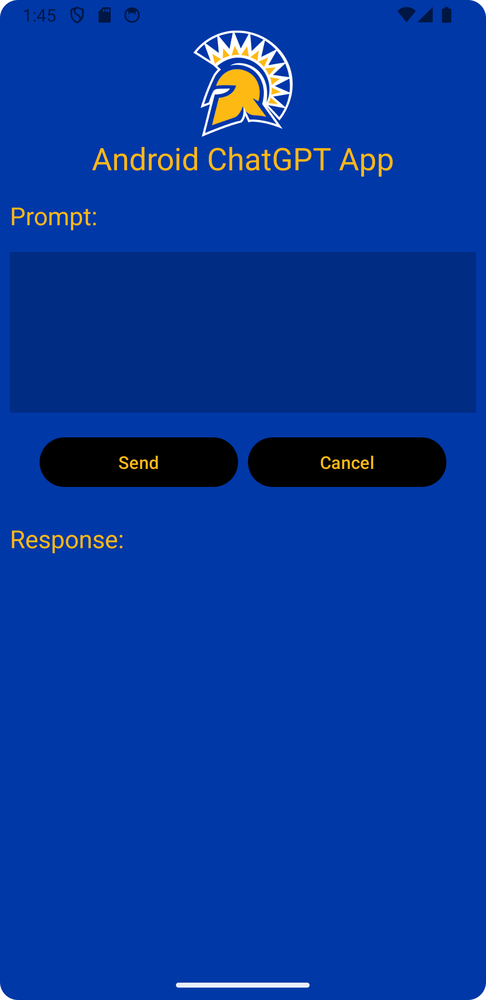
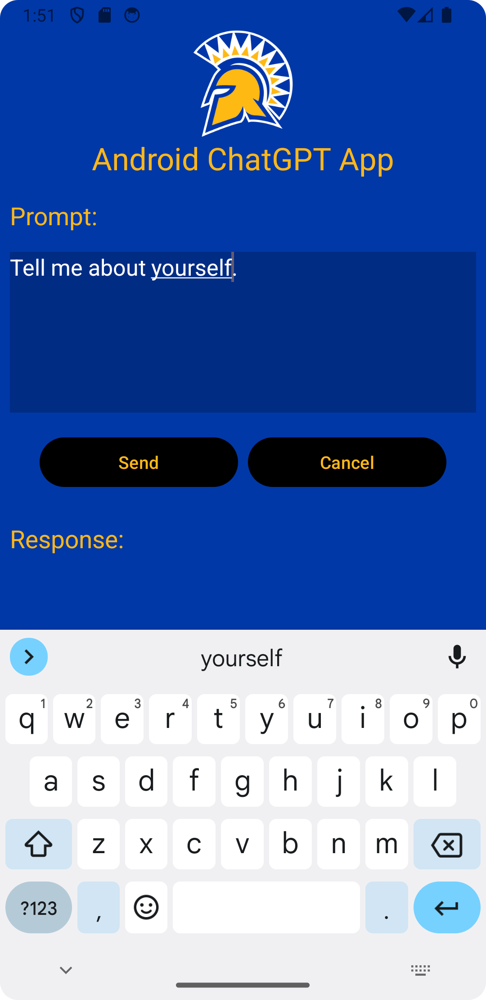
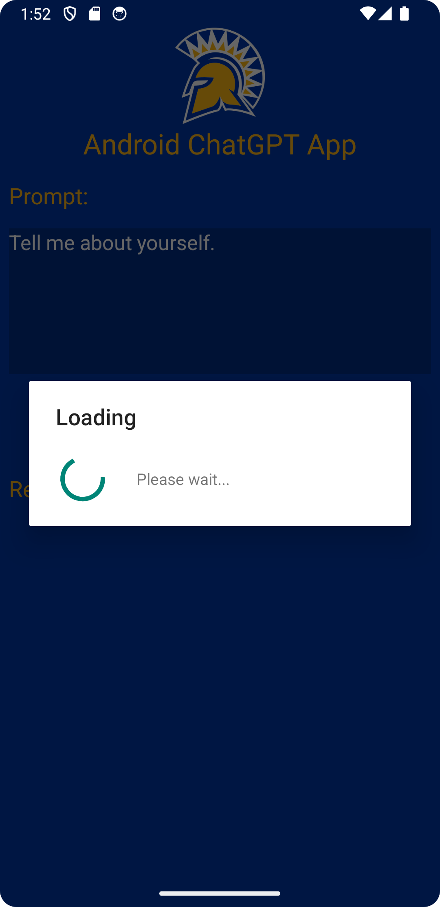
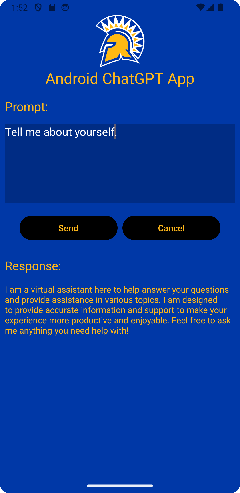

# CMPE277 - Android ChatGPT UI

## Assignmet Learning Objective

The purpose of the app is to apply AsyncTask to call Open AI LLM (ChatGPT 3.5 Turbo) model in the background and display response to the Android App.

## Authors

- [@Harshil-V](https://github.com/Harshil-V/)
- [@Chandrasekar Vuppalapati](chandrasekar.vuppalapati@sjsu.edu)

## Notes

- At API Key will need to be saved to the “local.properties” file.

## Screenshots

  

    
  

  

    
  

  

    
  

  

    
  

